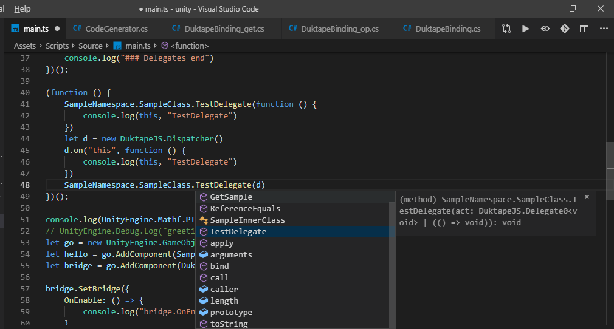
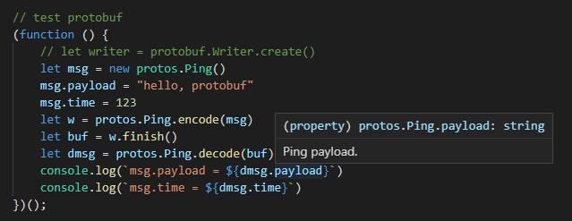

# 简介
将[duktape](https://github.com/svaarala/duktape)集成到Unity中, 使您可以在运行时动态加载执行javascript脚本. <br/>
另外也提供了对typescript的集成支持, 建议使用typescript进行脚本编写.



# 特点 
* nodejs形式的模块系统 或者 单一脚本 (根据不同的 tsconfig 配置)
* 生成静态绑定代码以及对应的d.ts声明文件
* setTimeout/setInterval/clearTimeout/clearInterval 写法基本兼容
* c# delegates 封装
* Unity常用值类型优化 (无GC) (Vector2/3,Quaternion,Color...)
* 集成定点数运算支持 ([libfixmath](https://github.com/PetteriAimonen/libfixmath))
* 集成 websocket ([libwebsockets](https://github.com/warmcat/libwebsockets))
* iOS (64bit, bitcode)
* Android (v7a, v8a, x86)
* 调试器支持 (vscode) (not implemented)
* tcp (not implemented)
* udp with kcp (not implemented)

您可以在项目中使用大部分纯js实现的的库, 比如 protobufjs.


# 类型定义文件 (d.ts)
自动生成的 d.ts 声明文件将提供完整的类型信息, 使您可以使用代码提示/重构/定义跳转/引用查询等各种方便有用的辅助功能!

- delegate 类型信息

- out/ref 参数的泛型约束

- Unity 常用泛型接口(AddComponent/GetComponent)的泛型约束


# 开发环境
如果您使用typescript编写脚本, 则需要在系统中安装 typescript (以便在 Unity 中调用 tsc)
```shell
npm install -g typescript
```

如果您需要从 duktape 源代码进行编译, 必须先安装 python/pip/pyyaml.
```shell
pip install pyyaml

# duktape-2.3.0/src-input: duktape source code
# duktape-2.3.0/src-custom: combined duktape source code
./configure_duktape.bat 
./make_duktape_<platform>
```

'./scratch' 是一个简单的功能测试命令行工程, 可以在一个简单的环境中运行测试一些 duktape 的功能, 方便调试.
```shell
./configure_duktape_scratch.bat
./make_duktape_scratch.bat
```

# 基本例子

```ts

// 如果在 tsconfig.json 中定义了 {"module": "commonjs"}, 那么就可以在脚本中使用类似 nodejs 的模块系统
// 否则可以像一般的 H5 工程类似, 将代码编译为单一js脚本, 进而可以进行 uglify 等操作.


// 以下代码是模块形式组织的 
// import module
import { B } from "base/b"
// import module with relative path (. or ..)
import { C } from "./base/c"

class MyPlayer {
    Start() {
        console.log("MyPlayer.Start")
        this.Jump()
    }

    // Update() {
    // }

    Jump() {
        console.log("MyPlayer.Jump")
    }
}

export class A {
    private go: GameObject
    constructor () {
        this.go = new GameObject("test go")
        this.go.transform.localPosition = new Vector3(1, 2, 3) 
        // use Bridge to receive Enable/Disable/Update 
        // don't use the approach a lot, it's better to dispatch futher logic in a single Bridge
        this.go.AddComponent(DuktapeJS.Bridge).SetBridge(new MyPlayer()) 

        let f = new Custom()
        // you can assign function to c# delegate
        f.onopen = function () {
            // ...
        }
        // if you want to register multiple listener, use DuktapeJS.Dispather 
        // you can also use typed Dispatcher generated in _DuktapeDelegates.d.ts, it provides type checks
        f.onload = new DuktapeJS.Dispatcher1<void, string>() 
        f.onload.on(this, this.onload)  // add listener
        f.onload.off(this, this.onload) // remove listener
        f.onload.off(this)              // clear all listeners of this
        f.onload.clear()                // clear all

        // 'out' parameter in c#
        let v = {}
        if (System.Int32.TryParse("123", v)) {
            console.log(v.target)
        }
    }

    private onload(ev: string) {
        let timer1 = setInterval(() => {
            console.log("interval")
        }, 1000)

        setTimeout((a, b) => {
            console.log("timeout", a, b)
            clearInterval(timer1)
        }, 5000, "Arg1", 123)
    }

    square() {
        console.log("A.square")
    }
}

// websocket
let ws = DuktapeJS.WebSocket()
ws.on("open", () => {
    console.log("connected")
    setInterval(() => {
        ws.send("hello, world") // string or buffer 
    }, 1000)
})
ws.on("data", data => {
    console.log("ws receive data", data) // string or buffer (depends on websocket message type you use)
})
ws.on("close", () => {
    console.log("connection lost")
})
ws.connect("ws://127.0.0.1:8080/echo")
setInterval(() => {
    ws.poll()
}, 50)

```

# 开发进度
目前还没有充分测试, 请不要用于生产环境!!! <br/>
Vector2/Matrix3x3/Matrix4x4/Quaternion 等值类型一部分在*C*中实现, 尚未经过完整测试. <br/>

# 基本使用流程
首次打开需要执行菜单 [Duktape -> Generate Bindings] 生成绑定代码.
如果检测到工程目录中存在 tsconfig.json, Unity 编辑器将自动尝试在 typescript 脚本变更时进行编译.

## 如何自定义导出

* duktape.json
可以修改 ProjectSettings\duktape.json 配置文件 (详细可配置项可以参考 Assets\Duktape\Editor\Prefs.cs 中的定义及注释说明)
```json
{
    "outDir": "Assets/Source/Generated",
    "implicitAssemblies": [
        "UnityEngine.CoreModule"
    ], 
    "explicitAssemblies": [
        "Assembly-CSharp"
    ],
    "tab": "    "
}
```
* 自定义一个编辑器运行时的类型并实现接口 Duktape.IBindingProcess (或者直接继承抽象类 AbstractBindingProcess)
```c#
public class MyCustomBinding : AbstractBindingProcess
{
    public override void OnPreCollectTypes(BindingManager bindingManager)
    {
        /*
        bindingManager.AddExportedType(typeof(MyCustomClass));
        bindingManager.TransformType(typeof(MyCustomClass))
            .SetMethodBlocked("AMethodName")
            .SetMethodBlocked("AMethodNameWithParameters", typeof(string), typeof(int))
        */
    }

    public override void OnCleanup(BindingManager bindingManager)
    {
        Debug.Log($"finish @ {DateTime.Now}");
    }
}
```

## 例子场景
Assets/Scenes/main.unity 展示了一些基本的使用情况.<br/>

# Referenced libraries

* [duktape](https://github.com/svaarala/duktape)
* [slua](https://github.com/pangweiwei/slua)
* [xLua](https://github.com/Tencent/xLua)
* [typescript-for-unity](https://github.com/SpiralP/typescript-for-unity)
* [godot](https://github.com/godotengine/godot)
* [libwebsockets](https://github.com/warmcat/libwebsockets)
* [mbedtls](https://github.com/ARMmbed/mbedtls)
* [libfixmath](https://github.com/PetteriAimonen/libfixmath)

# Misc.

* [vscode-duktape-debug](https://github.com/harold-b/vscode-duktape-debug)
* [duktape-doc-debugger](https://github.com/svaarala/duktape/blob/master/doc/debugger.rst)

